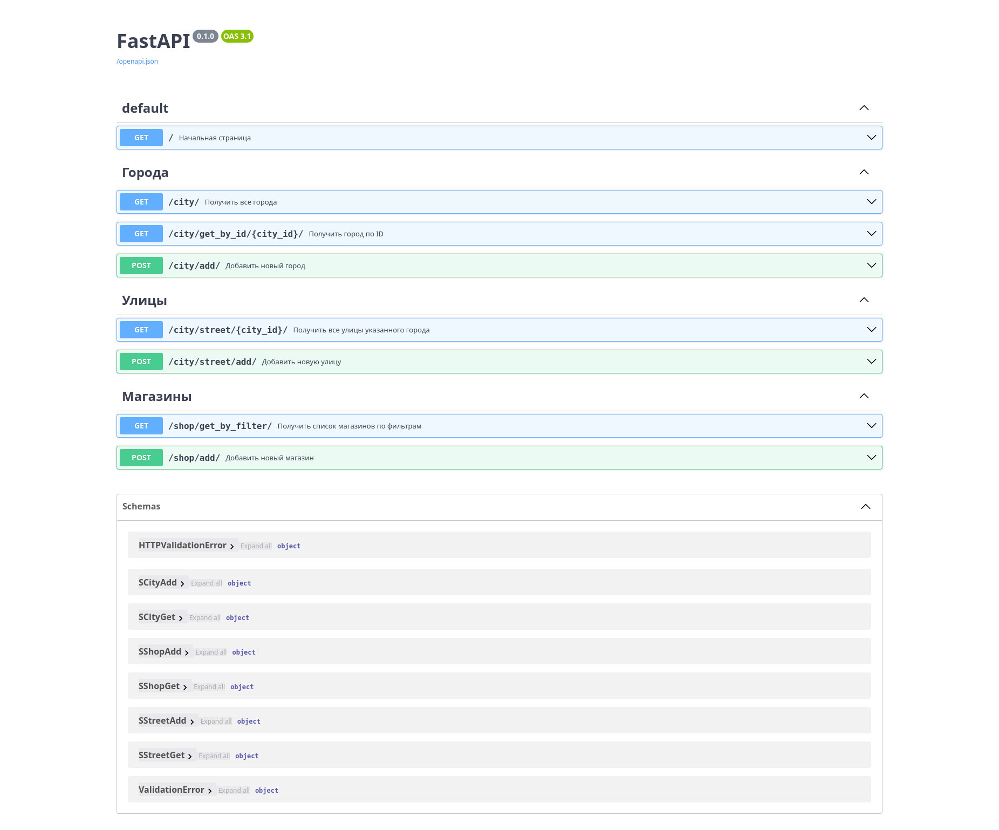

# Тестовое задание REST API

## Описание проекта

- Сервис для сохранения и получения информации о городах, улицах и магазинах
- Реализован с использованием _FastAPI_ и _SQLAlchemy_
- База данных _PostgreSQL_
- Сервис запускается с помощью _docker-compose_

---

## Функционал

В случае успешной обработки сервис отвечает статусом 200, в случае любой ошибки - статус 400.

### /city/ (GET) Получение всех городов

```markdown
# Получить все города
---
    :param session: AsyncSession - Сессия БД
---
    :return: [{
        id: "ID города",
        name: "Название города",
    },] - Список всех городов (JSON)
```

##### Example:

Request URL:

```bash
curl -X 'GET' \
  'http://127.0.0.1:8080/city/' \
  -H 'accept: application/json'
```

Response body:

```json
[
  {
    "id": 1,
    "name": "Ульяновск"
  },
  {
    "id": 2,
    "name": "Москва"
  },
  {
    "id": 3,
    "name": "Казань"
  },
  {
    "id": 5,
    "name": "Пермь"
  }
]
```

### /city/get_by_id/{city_id}/ (GET) Получить город по ID

```markdown
# Получить город по ID
---
    :param city_id: int - ID города

    :param session: AsyncSession - Сессия БД
---
    :return: {
        id: "ID города",
        name: "Название города",
    } - Город с переданным ID (JSON)
```

##### Example:

Request URL:

```bash
curl -X 'GET' \
  'http://127.0.0.1:8080/city/get_by_id/1/' \
  -H 'accept: application/json'
```

Response body:

```json
{
  "id": 1,
  "name": "Ульяновск"
}
```

### /city/add/ (POST) Добавить новый город

```markdown
# Добавить новый город
---
    :param city: SCityAdd {
        name: "Название города",
    } - Город (JSON)

    :param session: AsyncSession - Сессия БД
---
    :return: {"message": "Город с ID ... добавлен!"} - ID добавленного города (JSON)
```

##### Example:

Request URL:

```bash
curl -X 'POST' \
  'http://127.0.0.1:8080/city/add/' \
  -H 'accept: application/json' \
  -H 'Content-Type: application/json' \
  -d '{
  "name": "Волгоград"
}'
```

Response body:

```json
{
  "message": "Город с ID 6 добавлен!"
}
```


### /city/street/{city_id}/ (GET) Получить все улицы указанного города

```markdown
# Получить все улицы указанного города
---
    :param city_id: int - ID города

    :param session: AsyncSession - Сессия БД
---
    :return: [{
        id: "ID улицы",
        name: "Название улицы",
        city: {
            id: "ID города",
            name: "Название города",
        },
    },] - Список улиц указанного города (JSON)
```

##### Example:

Request URL:

```bash
curl -X 'GET' \
  'http://127.0.0.1:8080/city/street/1/' \
  -H 'accept: application/json'
```

Response body:

```json
[
  {
    "id": 1,
    "name": "Кирова",
    "city": {
      "id": 1,
      "name": "Ульяновск"
    }
  },
  {
    "id": 3,
    "name": "Рябикова",
    "city": {
      "id": 1,
      "name": "Ульяновск"
    }
  }
]
```

### /city/street/add/ (POST) Добавить новую улицу

```markdown
# Добавить новую улицу
---
    :param street: SStreetAdd {
        name: "Название улицы",
        city_id: "ID города",
    } - Улица (JSON)

    :param session: AsyncSession - Сессия БД
---
    :return: {"message": "Улица с ID ... добавлена!"} - ID добавленной улицы (JSON)
```

##### Example:

Request URL:

```bash
curl -X 'POST' \
  'http://127.0.0.1:8080/city/street/add/' \
  -H 'accept: application/json' \
  -H 'Content-Type: application/json' \
  -d '{
  "name": "Набережная",
  "city_id": 1
}'
```

Response body:

```json
{
  "message": "Улица с ID 4 добавлена!"
}
```


### /shop/get_by_filter/ (GET) Получить список магазинов по фильтрам

```markdown
# Получить список магазинов по фильтрам
---
    :param street_id: int - ID улицы

    :param street_name: str - Название улицы

    :param city_id: int - ID города

    :param city_name: str - Название города

    :param is_open: int(1|0) - Открыт|Закрыт магазин

    :param session: AsyncSession - Сессия БД
---
    :return: [{
        id: "ID магазина",
        name: "Название магазина",
        city: {
            id: "ID города",
            name: "Название города",
        },
        street: {
            id: "ID улицы",
            name: "Название улицы",
            city: {
                id: "ID города",
                name: "Название города",
            },
        },
        house: "Номер дома в формате 'НОМЕРбуква'",
        opening_time: "Время открытия магазина в формате 'ЧЧ:ММ:СС'",
        closing_time: "Время закрытия магазина в формате 'ЧЧ:ММ:СС'",
    },] - Список магазинов удовлетворяющих фильтрам (JSON)
```

##### Example:

Request URL:

```bash
curl -X 'GET' \
  'http://127.0.0.1:8080/shop/get_by_filter/?city_id=1&is_open=1' \
  -H 'accept: application/json'
```

Response body:

```json
[
  {
    "id": 4,
    "name": "Продукты",
    "city": {
      "id": 1,
      "name": "Ульяновск"
    },
    "street": {
      "id": 1,
      "name": "Кирова",
      "city": {
        "id": 1,
        "name": "Ульяновск"
      }
    },
    "house": "22б",
    "opening_time": "10:00:00",
    "closing_time": "22:00:00"
  },
  {
    "id": 5,
    "name": "Электроника",
    "city": {
      "id": 1,
      "name": "Ульяновск"
    },
    "street": {
      "id": 3,
      "name": "Рябикова",
      "city": {
        "id": 1,
        "name": "Ульяновск"
      }
    },
    "house": "10а",
    "opening_time": "08:00:00",
    "closing_time": "21:00:00"
  }
]
```

### /shop/add/ (POST) Добавить новый магазин

```markdown
# Добавить новый магазин
---
    :param shop: SShopAdd {
        name: "Название магазина",
        city_id: "ID города",
        street_id: "ID улицы",
        house: "Номер дома в формате 'НОМЕРбуква'",
        opening_time: "Время открытия магазина в формате 'ЧЧ:ММ:СС'",
        closing_time: "Время закрытия магазина в формате 'ЧЧ:ММ:СС'",
    } - Магазин (JSON)

    :param session: AsyncSession - Сессия БД
---
    :return: {"message": "ID созданного магазина: ..."} - ID добавленного магазина (JSON)
```

##### Example:

Request URL:

```bash
curl -X 'POST' \
  'http://127.0.0.1:8080/shop/add/' \
  -H 'accept: application/json' \
  -H 'Content-Type: application/json' \
  -d '{
  "name": "Продукты",
  "city_id": 2,
  "street_id": 2,
  "house": "13",
  "opening_time": "8:00:00",
  "closing_time": "22:00:00"
}'
```

Response body:

```json
{
  "message": "ID созданного магазина: 6"
}
```

---

## Запуск проекта

#### Для успешной работы проекта необходимо выполнить следующие шаги:

1. Установить _Docker_ на свой компьютер, если он еще не установлен: [_Get Started with Docker_](https://www.docker.com/get-started)

2. Склонировать данный репозиторий

```bash
git clone https://github.com/VadimBarinov/Test-Task-API.git
```

3. Перейти в директорию с проектом

```bash
cd Test-Task-API
```

4. Запустить приложение

```bash
docker-compose up
```

#### После запуска приложения будут созданы необходимые таблицы и загружены тестовые данные: `./db/init_script.sql`

#### Для доступа к базе данных используются следующие параметры:

- Database : mediasoft_shops
- User : admin
- Password : qwerty1234
- Host : db (также есть проброс на localhost:5432)
- Port : 5432

---

## Подключение к проекту

После выполнения подготовительных действий проект будет доступен по адресу

```bash
http://localhost:8080/
```

Проект также будет доступен по внутреннему _ip_ адресу вашего компьютера

---

## Swagger UI

Документация (Swagger UI) будет доступна по адресу:

```bash
http://localhost:8080/docs
```

Также доступ будет по внутреннему _ip_ адресу



---
